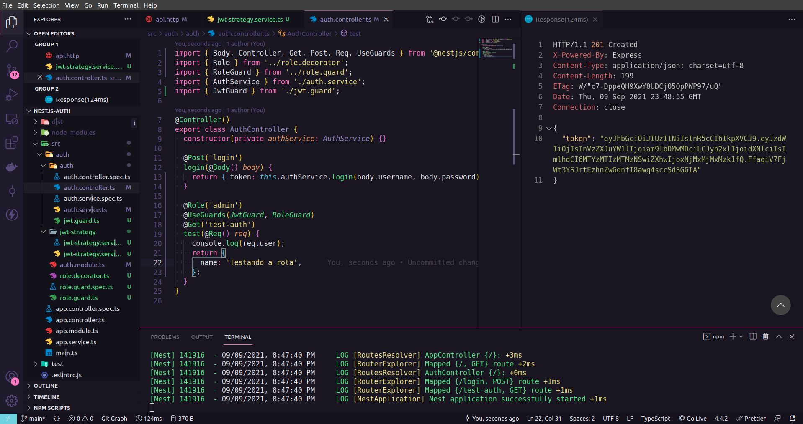

<p align="center">
  <a href="http://nestjs.com/" target="blank"></a>
</p>

[circleci-image]: https://img.shields.io/circleci/build/github/nestjs/nest/master?token=abc123def456
[circleci-url]: https://circleci.com/gh/nestjs/nest

<p align="center">Autenticação de usuário utilizando  JWT (Json Web Token) e NestJS</p>

<p align="center">
  

  

  
</p>

## Descrição

Uma API desenvolvida com o framework Nest.js e typescript, um exemplo básico de um sistema de autenticação utilizando JWT.



## Executar o projeto

```bash
# Clone o repositório
$ git clone https://github.com/jefferson1104/nestjs-auth.git

# Execute localmente
$ npm run start:dev

```

## Gerar uma senha com o bcrypt

```bash

## Executar o comando abaixo no terminal do projeto
node generate-password.js SENHA

## Exemplo
# comand: node generate-password.js 123456
# output: $2b$10$2QHAEW0XFWmCrxeJGBKa2eSXXvPcsWp.WWsohEfqzn1LWs/4NLvrS

```

## Licença

Nest is [MIT licensed](LICENSE).
